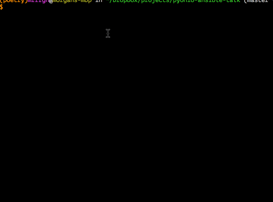

Ansible Example for PyOhio 2014
----------------

</img>

### Scalable Provisioning and Deployment with Ansible

### Description
In this interactive tutorial we'll be using Ansible, the latest DevOps hotness, to provision a server and deploy a commonly configured Django application. Along the way we'll leverage Ansible's features to deploy to IaaS providers and virtual machines; creating identical production and development environments in a DRY way.

#### link to slides: 
https://docs.google.com/presentation/d/15D290U6M6EZq7uq0TQlrhhR99RKtUdp-m2FNYWaU3KA/edit?usp=sharing

#### link to pyohio:
http://www.pyohio.org/schedule/presentation/108/
